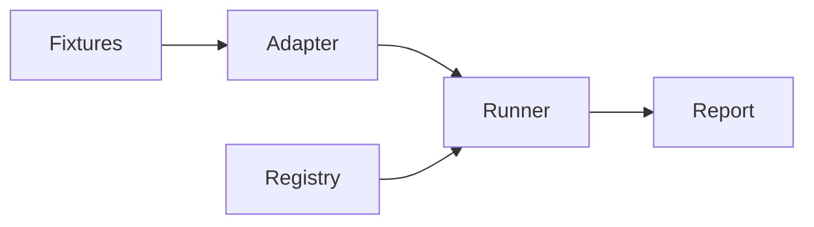

# Architecture

```mermaid
flowchart LR
Fixtures --> Adapter --> Runner
Registry --> Runner
Runner --> Report
```

The adapter makes a portal connection replaceable. The runner normalizes input, applies rules, and records partial coverage. Report components only display the read-only result.
